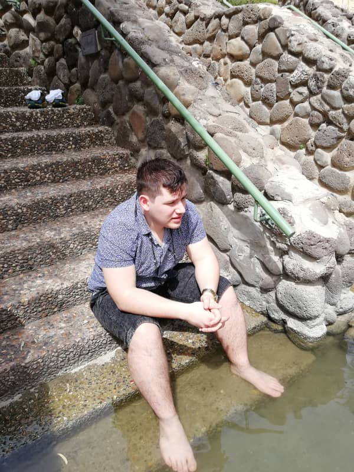
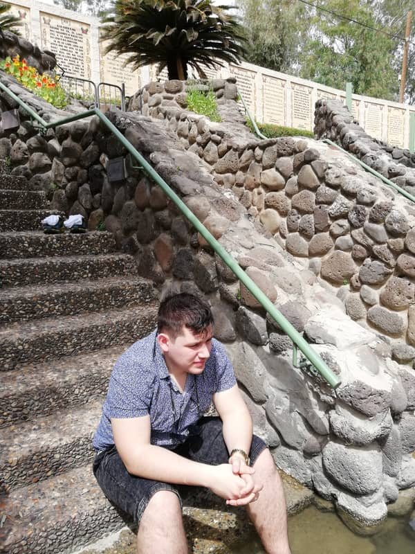
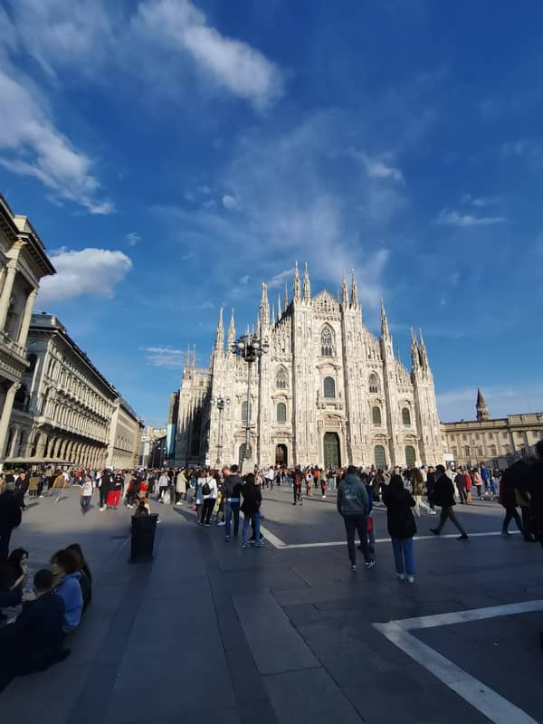
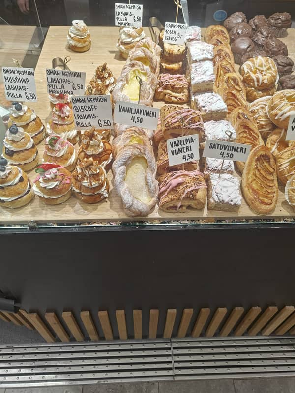
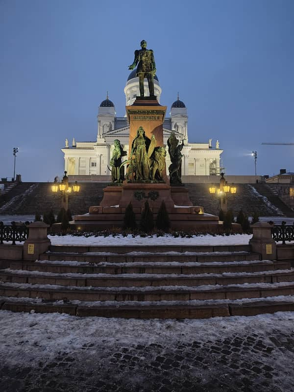

# Inpaint Sweep — Review (SAMPLE)

> **Dry-run preview.** Generated from 5 placeholder pairs by copying the same JPG to
> the `before` and `after` trees, so the "before/after" thumbnails are intentionally
> identical. The real sweep will produce visibly different thumbnails and be written
> to `docs/inpaint-sweep-results.md` (without the `-SAMPLE` suffix). Use this file
> only to preview the table layout, summary structure, and sign-off ergonomics.

People-removal review for the inpaint sweep across `public/photos/trips/`.
Tick `[x]` for **Accept**, leave both blank or tick **Reject**, then hand back to the agent.

## Summary

- Total inpainted pairs: **5**
- Trips touched: **3**
- Orphaned staging files (no matching original): **0**
- Before tree: `scripts/.inpaint-sample-before`
- After tree: `scripts/.inpaint-sample-after`
- Thumbnail cache: `docs/inpaint-sample-thumbs`

### Per-trip counts

| Trip slug | Photos in this sweep |
|---|---:|
| `2018-03-israel` | 2 |
| `2023-04-italy` | 1 |
| `2025-02-finland` | 2 |

### Decision tally (auto-counted from this doc)

After ticking, run `grep -c '\[x\] Accept' <doc>` and `grep -c '\[x\] Reject' <doc>`
to confirm the totals match what you expect before the apply step.

## Pairs by trip

### 2018-03-israel

| Filename | Before | After | Sign-off |
|---|---|---|---|
| `IMG_20180323_113715.jpg` |  |  | `[ ]` Accept `[ ]` Reject |
| `IMG_20180323_113718.jpg` |  |  | `[ ]` Accept `[ ]` Reject |

### 2023-04-italy

| Filename | Before | After | Sign-off |
|---|---|---|---|
| `IMG_20230402_181257.jpg` |  |  | `[ ]` Accept `[ ]` Reject |

### 2025-02-finland

| Filename | Before | After | Sign-off |
|---|---|---|---|
| `IMG20250221150611.jpg` |  |  | `[ ]` Accept `[ ]` Reject |
| `IMG20250222175401.jpg` |  |  | `[ ]` Accept `[ ]` Reject |
